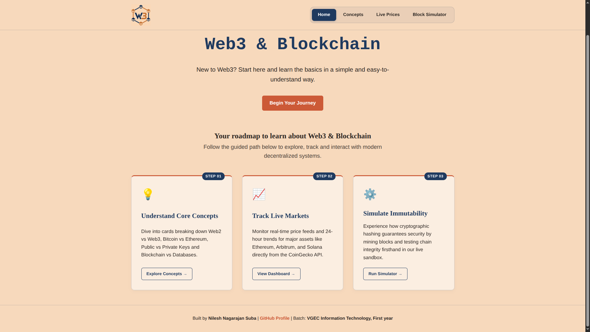
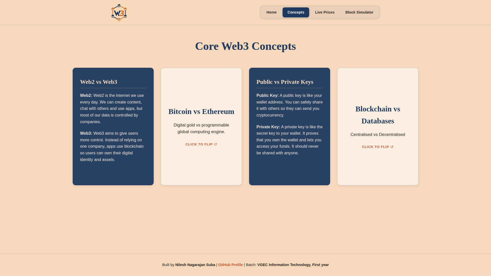
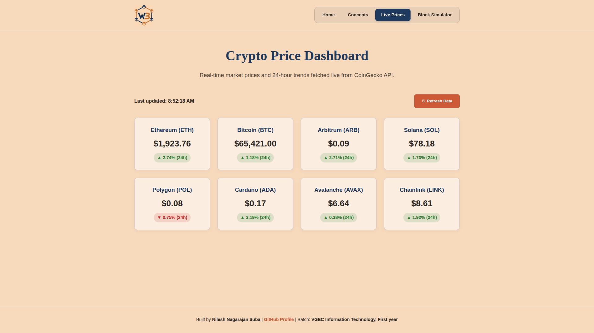
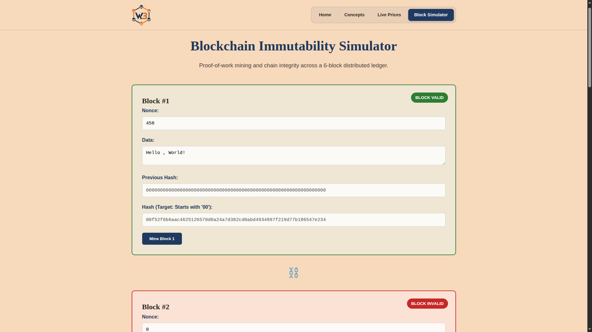

# arbitrum-builder-labs-project-entry

An interactive, multi-page web platform designed to explain blockchain concepts, track live market prices and simulate real-time block generation.

---

## 📑 Table of Contents
- [Features & Page Overview](#-features--page-overview)
- [Tech Stack](#-tech-stack)
- [Getting Started (Local Installation)](#-getting-started-local-installation)
- [Project Screenshots](#-project-screenshots)

---

## 🌐 Features & Page Overview

The platform consists of four pages designed to guide users through learning, tracking and simulating decentralized systems:

### 1. Home Page (`index.html`)
- **Web3 Decoding Title Animation:** A dynamic text-decoding effect that reveals the platform's focus.
- **Path to Learning Web3 & Blockchain:** Interactive step-by-step guidance introducing students to core concepts, market tracking and cryptographic immutability.

### 2. Concepts Page (`concepts.html`)
- **3D Flippable Concept Cards:** A single-row horizontal layout containing 4 interactive cards covering difference between Web2 and Web3, Bitcoin and Ethereum, Public and Private Keys, Blockchain and Databases.
- **Interactive Back Side:** Clicking any card flips it in 3D space to reveal explanations and glowing hover effects.

### 3. Live Prices Dashboard (`prices.html`)
- **Real-Time Crypto Ticker:** Connects directly to the CoinGecko API to fetch live USD prices and 24-hour percentage changes for 8 major cryptocurrencies (BTC, ETH, SOL, ARB, POL, ADA, AVAX, LINK).
- **Manual Refresh & Rate-Limit Handling:** Features an explicit update trigger along with friendly status messages for API limits.

### 4. Block Simulator Page (`simulator.html`)
- **Interactive Blockchain Sandbox:** A live 6-block chain that recalculates cryptographic hashes as block data or nonces are modified.
- **Visual Validation:** Displays dynamic status badges (`VALID` / `INVALID`) and state colors to demonstrate how changing a single block invalidates the downstream chain.

---

## 💻 Tech Stack

- **HTML5 & CSS3:** Semantic markup, custom CSS CSS Grid/Flexbox layouts, 3D transform perspectives and CSS variables.
- **JavaScript (ES6+):** Async/await API calls, dynamic DOM manipulation, cryptographic hashing functions and event listeners.
- **CoinGecko API:** REST API integration for real-time cryptocurrency price data.

---

## 🛠️ Getting Started (Local Installation)

Follow these steps to set up and run the project locally on your machine.

### Prerequisites
- A modern web browser (Google Chrome, Mozilla Firefox, Brave, or Safari).
- [Visual Studio Code](https://code.visualstudio.com/) (recommended) with the **Live Server** extension installed.

### Installation Steps

1. **Clone the repository:**
    ```bash
   git clone [https://github.com/nileshns-dev/arbitrum-builder-labs-project-entry.git]
    ```

2. **Navigate into the cloned project directory**
    ```bash
    cd arbitrum-builder-labs-project-entry
    ```
3. **Open and Run the Project**

    1. Launch **Visual Studio Code** and select **File > Open Folder...**, then select the project folder.
    2. Install the **Live Server** extension by *Ritwick Dey* from the VS Code Extensions marketplace.
    3. Right-click on `index.html` in the File Explorer pane.
    4. Click **Open with Live Server**.
    5. The platform will automatically launch in your default web browser at `[http://127.0.0.1:5500](http://127.0.0.1:5500)`.


## Project Screenshots

### Home Page


### Concept Cards


### Live Prices Dashboard


### Block Simulator
